# Milestone Project One

## Personal Portfolio
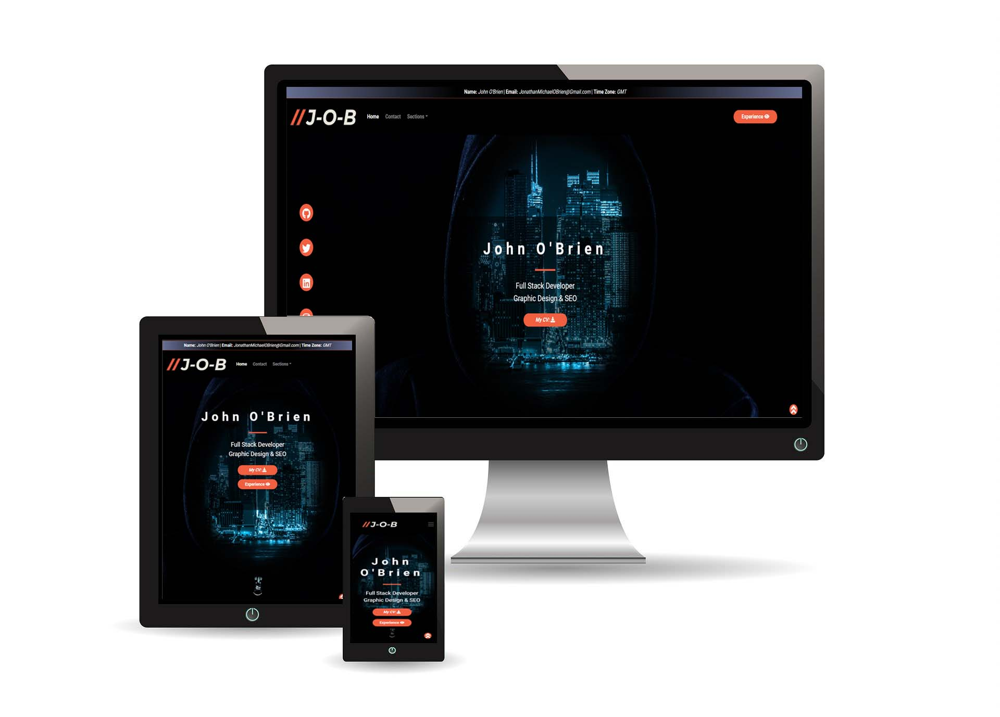

Welcome to my first milestone project! For this project, I chose to create a personal portfolio. My 
    reasoning for this selection is based on the fact that I can use this project to come back to as I 
    progress through [Code Institute](https://codeinstitute.net) and display my work in the "Projects" section of this page.

After researching full stack developer portfolios online (Google and YouTube), I noticed almost all developers implement a single page design. 
I like this design and chose to follow what seems to be the "norm" in this category.

This project on-top of being a milestone project also serves as a real-world project. I recently purchased a domain, which I will host 
this project on, however, I will wait to deploy this project on such a live environment until a later date where I may restrict access to 
items such as my CV. 

### Table of contents:
1. [Description](#Description),
2. [UX](#UX)
    1. [Logo](#Logo)
    2. [Wireframes](#Wireframes)
    3. [User Stories](#User-Stories) 
    4. [Information Architectures](#Information-Architectures)
    5. [Responsive Design](#Responsive-Design)
    6. [Frameworks](#Frameworks)
    7. [Typography](#Typography)
    8. [Colors](#Colors)
    9. [Icons](#Icons)
3. [Features](#Features)
    1. [Existing Features](#Existing-Features)
    2. [Future Features](#Future-Features)
4. [Technologies Used](#Technologies-Used)
5. [Testing](#Testing)
6. [Deployment](#Deployment)
    1. [Local Deployment](#Local-Deployment)
    2. [Remote Deployment](#Remote-Deployment)
7. [Credits](#Credits)
    1. [Media](#Media)
    2. [Content](#Content)
    3. [Attribution](#Attribution)
    4. [Acknowledgments](#Acknowledgments)

## **Description**
This development is a personal portfolio page. This project aims to convey my experience to a potential recruiter. Displaying 5 key sections: About Me, Skills, Projects, What I Offer & a Contact Form.

This project aims to show supporting documentation which does not fit on a basic CV, instead, this project aims to accompany my CV where a potential recruiter, or collaborator,
can view my experience, skills, projects, what I can add to a team, and ultimately contact me, or download/view my CV.

This project is designed in such a way that the structure can easily be added to, or modified in the future for simplification of future updates. At this point, this project uses mainly HTML 
and CSS with Bootstrap and jQuery (via CDN) as well as a minimal amount of JavaScript (for sound file *accessibility*). In the future, this project will bring in more JavaScript functionality such as a "tag cloud" for projects, I could incorporate this feature now, but I chose only to use features I understand completely.

*Accessibility* of the sound file uses JavaScript to enable users who cannot use a mouse play/pause and stop the sound file.  

---------------
## **UX**
Being a front end development, UX was extremely important. Easy access to information via easy to find links, as well as creating a relaxed, yet professional design was possibly the most important feature of this project. Using specific repetition in areas is one key aspect of this portfolio, 
for example, I have implemented the same style and color button for all-important "clickable" links, all individual sections are 'highlighted' by using a darker background, this makes sections raise up from the background and also 
allows for easy reading of the page content. After building this page, I got friends and family to browse the page (without telling them about any features), one item that was highlighted was the images 
in the "What I Offer" page, as a result of this live test, I have made these images clickable which also opens the relevant modal popup.

On loading, in the center of the screen is the welcome area showing Who I Am, What I Do & Why I'm Here (Name, What I Do & My CV).
In the same order as the above "Who, What, Why", as a user scrolls they will see:

1. **Who I am** - An introduction to myself - *"About Me" section,* 
2. **What I do** - What skills do I have? What help can I provide? What have I worked on? - *"Skills", "Projects" & "What I Do" sections,*
3. **Why I'm here** - I'm here to get in contact with a potential recruiter or collaborator - *"Work With Me section" (Contact me form)*

#### 5 Planes of UX:
1. Strategy:
>The reason for this project is to publish a portfolio page that potential recruiters can view my work, or where collaborators can contact me about a project. ([User Stories](#User-Stories) Below)

2. Scope:

*Functional Requirements:*
>Provide the capability to contact me, as well as download a copy of my CV.

*Content Requirements:*
>Provide additional information which does not fit on a CV, such as a longer about me section and example areas "products" I can provide to a business or project partner.
>View my projects, repositories, and skills.

3. Structure:
> * A single-page layout. 
>
> * I do not want to overload a user with information. To stop this from happening use 'popup' style features such as "read more", this will give the user 
>the power to view as much information as they would like to see & improve user interaction. 
>
> * A logical 'start to finish' layout from top to bottom, that will ultimately tell my story as a user scrolls. 
>
> * Each section will add a small amount of 'new' information to the user, and each section will have interactive features to engage the audience, such as pop-ups, links, or downloads.

4. Skeleton:
> With the above steps in place, I have created wireframes for desktop, tablet & mobile device. (View them [here](#Wireframes))
>
> After looking at the layout of other portfolios, I will implement the following sections: Welcome, About, Skills, Projects, What I Offer, Work With Me (Contact).

5. Surface:
> Finally, the look of the page (being a portfolio) was high up on the level of importance. To achieve the look that I wanted, but in keeping with good UX, I have added "cards" 
> for each section, this is a subtle design feature to show sections as individual "blocks", each "block" is independent of one another and tells it's own section of my "story".
>
> Being a development portfolio, I aim to use colors similar to colors seen in computer "dark mode" such as white (or just off white) as a text color, a blue color and use an 
> eye-catching color for buttons that I can try to grab a user's attention with.

### <ins>**_Logo_**</ins>
As branding is such a huge part of sales and promotion, I wanted to create a simple, yet professional looking logo. As I am open to freelance work, I believe that creating a 
brand around myself is quite important and I will continue to work on building this over the coming months and years. 

(I have seen a very similar logo on [WIX](https://wix.com) however the image in this project was created by myself in Photoshop, the idea of the design comes from a 
JavaScript comment, using two forward slashes followed by my initials.)

### <ins>**_Wireframes_**</ins>
You can view the wireframe designs [here](assets/readme/wireframe_design.pdf)

*Please note that the skills section is omitted from the wireframe designs. This feature was included at a later date (this also shows how easy it is to add a new 
section to this project).

Alternatively, you can navigate to the Assets folder, then open the Readme folder for all assets contained
    within this Readme file.

### <ins>**_User Stories_**</ins>

Being a personal portfolio the following user stories specific to this project are: 

| **As the creator I want to:** |
| ------------------------------------------------------- |
|1. *Introduce myself to recruiters or collaborators.* |
|2. *Showcase my skills.* |
|3. *Show my projects.* |
|4. *Breakdown what I can do to show specific areas of expertise (incase of freelance work).* |
|5. *Get contacted about potential job or work opportunities.* |

| **As a user I want to:** |
| ------------------------------------------------------- |
|1. *Find out who John is* |
|2. *See Johns skills* |
|3. *Find out what experience John has* |
|4. *View the projects John has worked on / completed* |
|5. *See what services John can add to our company / team* |
|6. *Download a CV* |
|7. *View John's social media* |
|8. *Contact John* |

### <ins>**_Information Architectures_**</ins>

Located in the center of the page is my name, what services I can offer, as well as a button linking to my CV, on the periphery are links to my social media (desktop / larger 
screen widths). A top navbar is available to navigate directly to any specific section on the page.

Scrolling down from the welcome area a user will encounter several sections, I aimed to keep sections short (on purpose) to avoid an overload of information. This design concept 
allows me to keep the sections smaller and not overload a user with information. This design allows the page to flow easily from one section to the next, picking up useful 
information along the way.

From anywhere on this portfolio page, you can get to any information in 4 or less clicks. 

### <ins>**_Responsive Design:_**</ins>
Each section of this project is responsive. All sections are contained within collapsable sections to allow a great user experience across all devices.

Other responsive design features include the "repositioning" of buttons depending on user screen width. This was achieved by creating two 
objects and using the "display: hidden" CSS to target specific screen widths and maintain a highly responsive design.

### <ins>**_Frameworks:_**</ins>

Adding to this project are the frameworks of both Bootstrap and jQuery. These frameworks form the structural
    the layout of the page, as well as provide the modal form.

### <ins>**_Typography_**</ins>

For this project, the main typography is Roboto, with Sans Serif as a backup.

### <ins>**_Colors_**</ins>
The main colors of this page are RGB 240, 95, 64 as well as RGB 0, 21, 107.

A subtle addition is the fact that all "action" buttons feature RGB 240,95,64, where as all information sections feature RGB 0,21,107.

RGB 240,95,64 also features in the two forward slashes in the logo.

### <ins>**_Icons:_**</ins>
Logos are placed in multiple locations on this page. They are all supplied via FontAwesome CDN.

--------------------
## **Features**

### <ins>**_Existing Features:_**</ins>

Currently, this project has several features including a modal popup, links to download my CV, and a lot of 
interactive features using CSS hover effects.

The contact form is currently working thanks to a free website called [FormSpree](https://formspree.io/) which 
has allowed me to create a basic HTML form, without the need for any additional JavaScript or PHP.

I have also included features that are layered using Z-Index, this allowed me to include the back to top feature
as well as the social media sidebar.

Accessibility is a huge part of this project. To help users who may depend on this, I have included ALT text for every image on the page, 
I prior to using a certain color, I have checked the contrast of colors between the foreground and background to comply with [WCAG guidelines](https://color.a11y.com/ContrastPair/), 
as well as include screen reader text for every button to assist the visually impared. I initially included a basic HTML audio file, however, after reading that 
the standard HTML 'audio controls' do not comply with keyboard accessibility, I added a two simple JavaScript buttons (Play/Pause and Stop), this JavaScript is attached onto the HTML 
code which now allows keyboard accessibility to this function.

### <ins>**_Future Features:_**</ins>
In the future this portfolio will include more JavaScript, for example, the 'back to top' button would be nicer if it was a scrolling motion rather than a simple jump 
back to the top of the page. I also plan on updating the contact form to use an API rather than the current feature which uses [FormSpree](https://formspree.io/) to handle 
the mail.

A more advanced feature I would like to add in the future is the interaction of this page. I aim to keep the welcome area as a "dashboard" where all sections can be accessed 
via interactive script in a "web style" link structure.
    
------------------
## **Technologies Used**
For this project, HTML & CSS were used, as well as Bootstrap and jQuery via CDN.

The form on this portfolio page also uses a 3rd party email provider to deliver emails to my Gmail account.

---------------------
## **Testing**
To test this project I first used [W3C_validator](https://validator.w3.org/) to check all HTML, I then checked all of the CSS via the [W3C_Validation](https://jigsaw.w3.org/css-validator/).

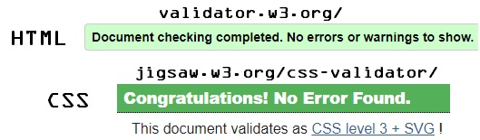

Adding to these tests, I used dev tools in my browser (Chrome) to see specific areas that I wanted to change. As this project is a front end project, the majority of my testing 
was that of design and the use of dev tools to achieve this.

Using Chrome Dev Tools, I viewed each section of this page on desktop, as well as both portrait and landscape layouts on tablet and mobile to ensure a 100% responsive design.

Once these resources confirmed no errors in the code of the project, I then used "lighthouse" in the Google Chrome
dev tools to ensure compliance across all categories. 

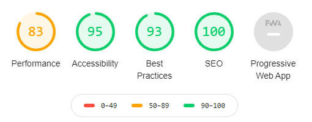

### Performance:
> To boost my performance score, I have changed all my images to .jpg format, as well as lowered their size, but not to a point that changed their overall quality. To 
raise this score, I could possibly have used "next gen" format such as WebP. With that being said, I was not willing to lower the quality of the design of my page to 
improve this score.

### Accessibility:
> To increase accessibility I have used alt text, screen reader text (where needed) and have implemented JavaScript buttons for my audio file instead of the basic 
HTML 'audio controls', this will allow users who cannot use a mouse access the specific buttons. This page also implements structured heading order. I have also implemented 
colors, and designs that are accepted under [WCAG](https://www.w3.org/WAI/standards-guidelines/wcag/) (Web Content Accessibility Guidelines).

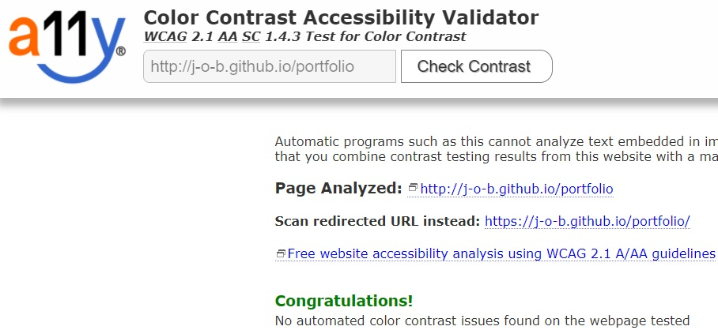

### Best Practices:
> Unfortunately lighthouse was picking up my image as if it should be a larger image ("Expected Size: 486 x 180"), I did try to see how this size worked, but I did not 
like the look, hence the lower score.

### SEO:
> Being a basic HTML document this project follows the basic SEO principles including a meta description, a favicon, and other basic SEO principles such as heading 
structure paragraph lengths and other features.

--------------------
## **Deployment**

### <ins>**_Remote Deployment:_**</ins>
To deploy this project remotely, you can follow these steps:
>1. Log Into GitHub.
>2. Navigate to my GitHub repository for this project which can be found [here](https://github.com/J-O-B/portfolio).
>    
>   (Close to the top of the page, there is a navigation bar, the first item here is "<>Code", the last item is "Settings".)
>
>3. Click on settings
>4. Scroll down the page until you find the section labeled "GitHub Pages"
>5. The first item in GitHub Pages is "Source", click the associated dropdown button labeled "None". 
>6. You will now have to select "master branch" as the source.
>7. Once you have selected "master" click the "Save" button. 
>8. The page should now refresh so you may have to scroll back down to "GitHub Pages".
>9. Now you will see a link presented which should look like this https://j-o-b.github.io/portfolio/.

### <ins>**_Cloning This Project:_**</ins>
>1. On GitHub, navigate to the main page of the repository.
>2. Above the list of files, click download Code icon. (a down arrow with a line under it)
>3. To clone the repository using HTTPS, under "Clone with HTTPS", click the clipboard icon. To clone the repository using an SSH key, 
> including a certificate issued by your organization's SSH certificate authority, click Use SSH, then click the clipboard icon. 
> To clone a repository using GitHub CLI, click Use GitHub CLI, then click the clipboard icon.
>4. Open Git Bash.
>5. Change the current working directory to the location where you want the cloned directory.
>6. Type git clone, and then paste the URL you copied earlier.
        $ git clone https://github.com/YOUR-USERNAME/YOUR-REPOSITORY
>7. Press Enter to create your local clone.
        $ git clone https://github.com/YOUR-USERNAME/YOUR-REPOSITORY
        > Cloning into `Spoon-Knife`...
        > remote: Counting objects: 10, done.
        > remote: Compressing objects: 100% (8/8), done.
        > remove: Total 10 (delta 1), reused 10 (delta 1)
        > Unpacking objects: 100% (10/10), done.

(Further information on cloning can be found at [GitHub Docs](https://docs.github.com/en/free-pro-team@latest/github/creating-cloning-and-archiving-repositories/cloning-a-repository)
----------------------
## **Credits**
Although most of the content and code in this project are my own, I have also used code snippets from bootstrap, for example, the modal popup is the standard bootstrap modal which was then changed to the specifications I wanted.
    
>* The navbar is based on the same navbar which was used in Whiskey Drop.
>* "Progress bars" (used in experience modal & full stack modal) are direct copies of the progress bars used in the Code Institute Resume walkthrough.
>* The entry animation for the website header is based on code from [Animista](https://animista.net/)
>* The "social media sidebar" and back to top button is based on [W3Schools](https://www.w3schools.com/howto/howto_css_fixed_sidebar.asp) (same method used for back to top button.)
>* The footer layout is based on the footer section used in the Resume tutorial.
>* The modal feature is based on a code snippet from [Bootstrap Documentation](https://getbootstrap.com/docs/4.5/components/modal/).
>* The "feature" section of my CSS is original yet based on a tutorial from W3Schools.com
    

### <ins>**_Media:_**</ins>
>**Background Image** - [Pixabay Stock & Royalty Free Image](https://pixabay.com/illustrations/hacker-attack-mask-binary-one-4703109/)
>
>**Whiskey Glass Image** - [Pixabay Stock & Royalty Free Image](https://pixabay.com/photos/whiskey-bar-alcohol-glass-scotch-315178/)
>
>**Full Stack Image** - [Pixabay Stock & Royalty Free Image](https://pixabay.com/illustrations/web-web-developer-1935737/)
>
>**Content Writing Image** - [Pixabay Stock & Royalty Free Image](https://pixabay.com/photos/cms-wordpress-265127/)
>
>**HTML Logo** - [CleanPNG](https://www.cleanpng.com/png-web-development-html-logo-world-wide-web-consortiu-634943/)
>
>**Java Logo** - [CleanPNG](https://www.cleanpng.com/png-java-logo-programming-language-java-plum-964780/)
>
>**JavaScript Logo** - [CleanPNG](https://www.cleanpng.com/png-javascript-logo-html-comment-blog-1647031/)
>
>**CSS Logo** - [CleanPNG](https://www.cleanpng.com/png-web-development-cascading-style-sheets-css3-html-1615602/)
>
>**Bootstrap Logo** - [PieceX](https://www.piecex.com/articles/Migrating-to-Bootstrap-4-280)
>
>**Python Logo** - [CleanPNG](https://www.cleanpng.com/png-python-computer-icons-tutorial-computer-programmin-1216454/)
>
>**SQL Logo** - [CleanPNG](https://www.cleanpng.com/png-microsoft-azure-sql-database-microsoft-sql-server-870894/download-png.html)
>
>**SEO Image** - [Pixabay Stock & Royalty Free Image](https://pixabay.com/photos/search-engine-optimization-seo-4111000/)
>
>**Graphic Design Image** - [Pixabay Stock & Royalty Free Image](https://pixabay.com/photos/laptop-mockup-graphics-tablet-2838921/)
>
>**Audio** - AI voice provided by Google Wavenet (chrome extension)
>
>**Logo** - This logo uses the idea from a [WIX](https://wix.com) logo, however, the logo on this website is created by myself in Photoshop, using the same style design as seen on WIX.

### <ins>**_Content:_**</ins>
All of the text content in this project is original content. See above for image credits & acknowledgements, for code attribution see below.

### <ins>**_Attribution:_**</ins>
This project incorporates both Bootstrap and JS via CDN. The creators of these features belong to their respective owners & creators. 

Media: Play, Pause and Stop buttons incorporate JavaScript which is a snippet from Mozilla Developer (prior to editing the code).

Navbar: Idea for layout taken from Whiskey Drop.

Footer: Layout idea taken from Resume walkthrough.

Bootstrap: Structure of sections, modal popup, 

Animista: Entrance animation for title text.

W3Schools: CSS feature to scale on hover (although this was then edited to my liking).

### <ins>**_Acknowledgments:_**</ins>
I would like to acknowledge both my mentor <ins>Caleb Mbakwe</ins> for his tips during this project. I would also like to thank 
<ins>Matt Rudge</ins> for his tutorial on Bootstrap, which this project is dependent on.

## *Previews*:
### Homepage / Welcome Section:

### About Me Section:
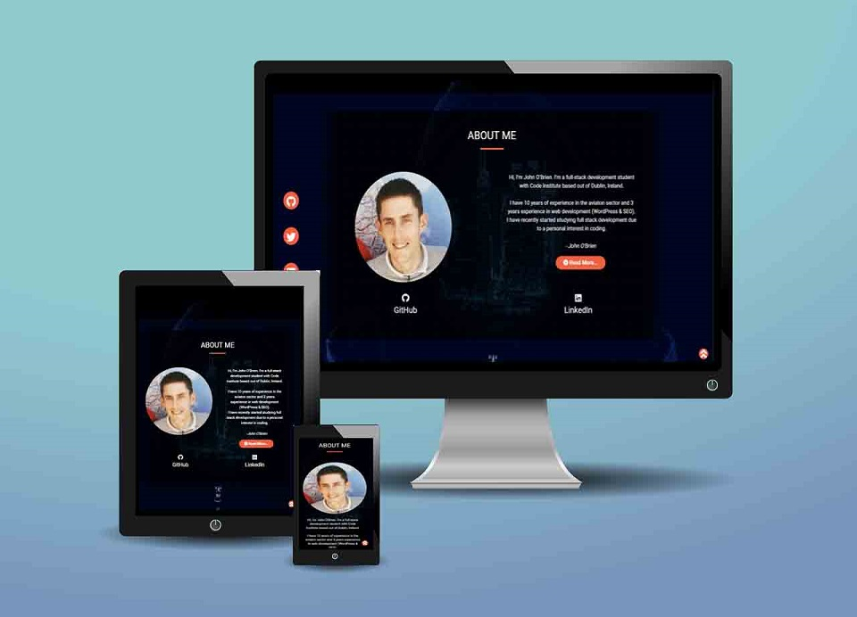

### Skills Section:
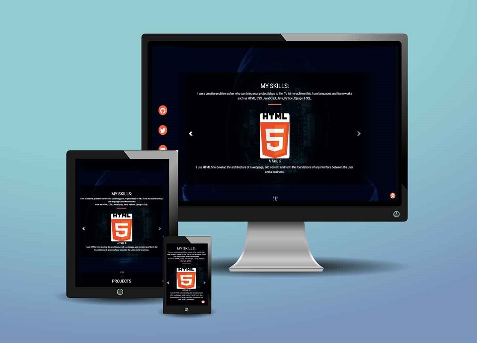

### Experience Popup:
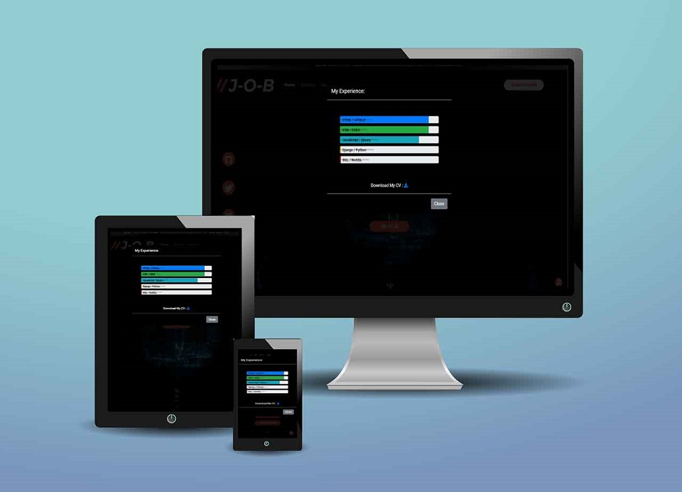

### Projects Section:
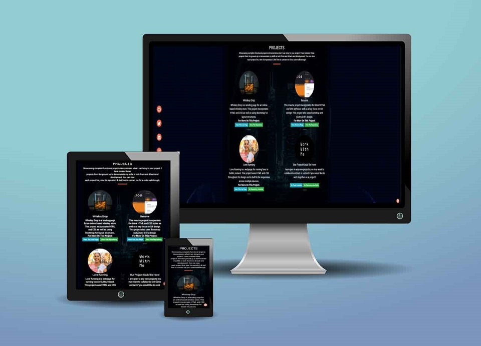

### "What I Offer" Section:
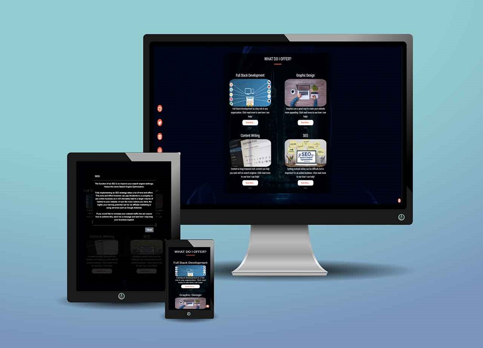

### Contact Form:
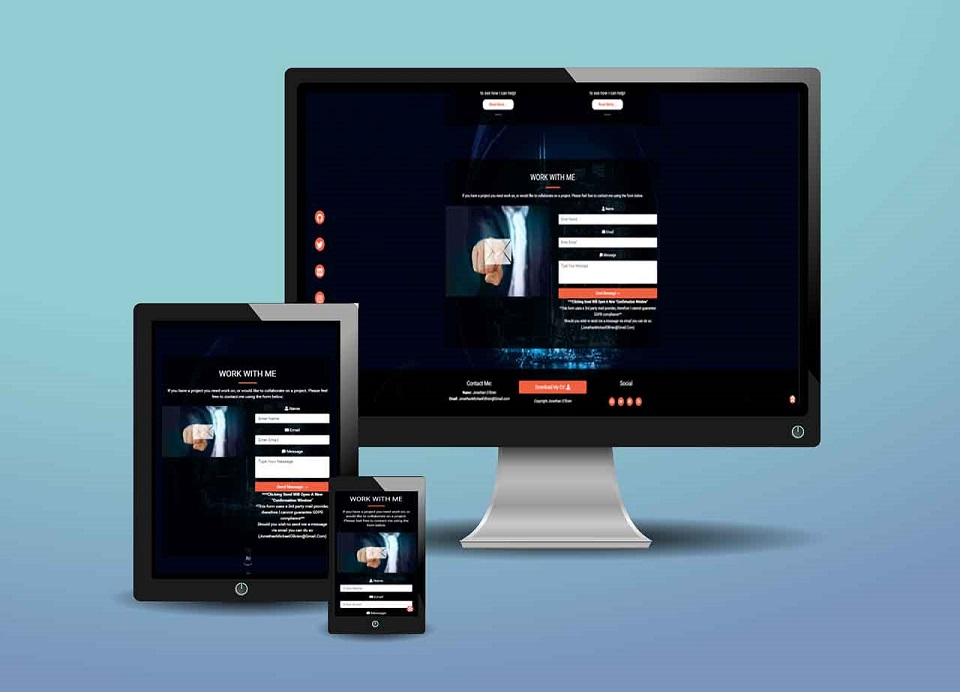
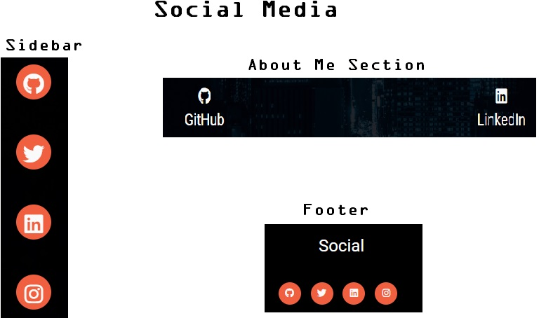
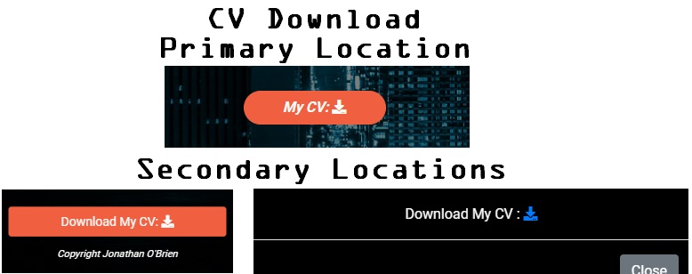